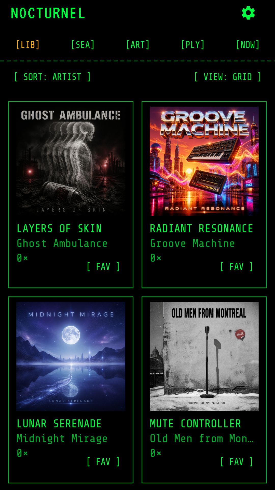
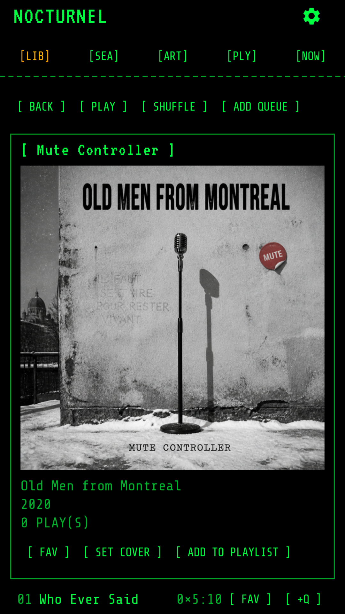
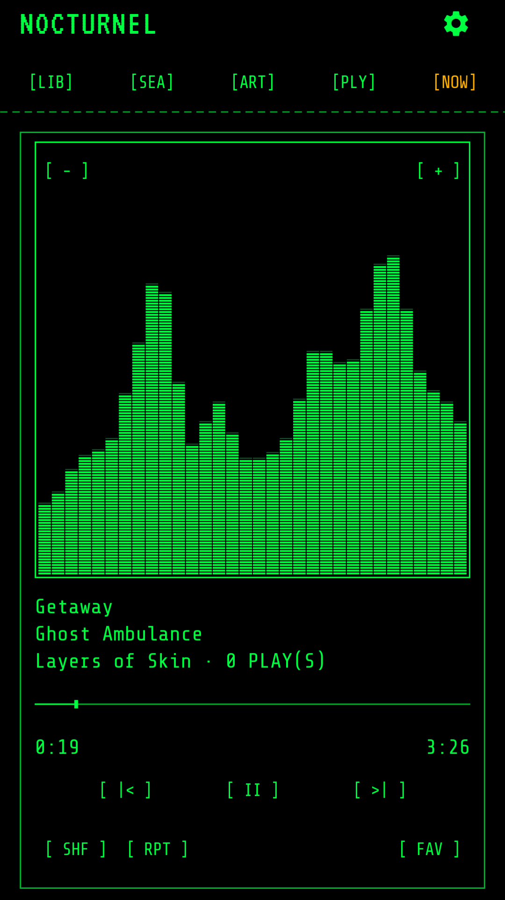
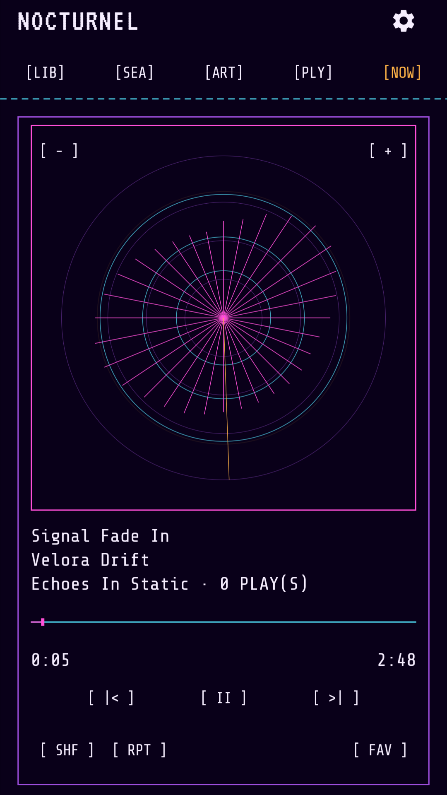
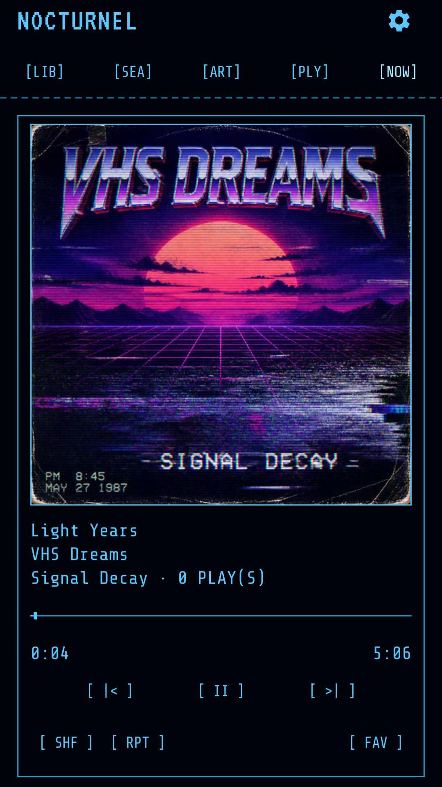

<p align="center">
  
</p>

<h1 align="center">NocturneL</h1>

<p align="center">
  An offline, terminal-themed Android music player for the library you already own.
</p>

<p align="center">
  <a href="https://github.com/godwept/NocturneL/actions/workflows/android.yml"></a>
  
  
  
</p>

NocturneL turns a folder of local audio files into a focused, phosphor-green listening experience. Pick a music folder, scan it, and browse your collection without accounts, ads, analytics, or an internet connection.

## Screenshots

| Library | Album | Spectrum bands | Radar visualizer | Album artwork |
|:---:|:---:|:---:|:---:|:---:|
|  |  |  |  |  |

## Highlights

- **Your music, on your device** — grant access to one folder through Android's system picker; NocturneL scans only that folder and its descendants.
- **A library built for browsing** — move between album and artist views, search your collection, switch between grid and cover-flow layouts, and sort by artist, title, year, or play count.
- **Full playback control** — background and lock-screen playback, gapless transitions, shuffle, repeat, seeking, and a drag-reorderable queue.
- **Terminal visualizers** — cycle between album art, a circular radar, and responsive spectrum bands with adjustable sync and phosphor afterglow.
- **Playlists that stay portable** — create and reorder local playlists, import or export M3U/M3U8 files, or back up every playlist in a single ZIP.
- **Listening activity** — keep favorites, play counts, recently played albums, and listening history locally on the device.
- **Artwork fallbacks** — use embedded artwork or common cover files such as `cover.jpg`, `folder.jpg`, `albumart.jpg`, and `front.jpg`.

Supported audio file extensions are MP3, M4A, AAC, OGG, Opus, WAV, and FLAC. Actual playback support can vary with the device's Android media codecs.

## Privacy by design

NocturneL has no internet permission. It contains no advertising, analytics, telemetry, remote crash reporting, or user accounts. Library metadata, playlists, history, favorites, playback state, and settings remain on your device, and Android cloud backup is disabled.

See the full [privacy policy](https://godwept.github.io/NocturneL/privacy/) for details.

## Build from source

### Requirements

- JDK 17
- Android SDK with API 36 installed
- Android Studio, or the included Gradle wrapper

Clone the repository and build a debug APK:

```bash
git clone https://github.com/godwept/NocturneL.git
cd NocturneL
./gradlew assembleDebug
```

On Windows, use `./gradlew.bat assembleDebug` instead. The APK is written to `app/build/outputs/apk/debug/app-debug.apk`.

Run the same core checks used by CI:

```bash
./gradlew testDebugUnitTest validateDebugScreenshotTest assembleDebugAndroidTest lintRelease
```

Every successful [Android CI run](https://github.com/godwept/NocturneL/actions/workflows/android.yml) also publishes a `nocturnel-debug-apk` workflow artifact for signed-in GitHub users.

## Tech stack

- Kotlin and Jetpack Compose
- AndroidX Media3 / ExoPlayer and MediaSession
- Room for the on-device catalog, playlists, and listening data
- Android Storage Access Framework for user-controlled file access
- Coil for album artwork
- JUnit, AndroidX Test, and Compose screenshot tests

## Project layout

| Path | Purpose |
|---|---|
| `app/src/main` | Application, playback, library, persistence, and Compose UI code |
| `app/src/test` | JVM unit and contract tests |
| `app/src/androidTest` | On-device integration tests |
| `app/src/screenshotTest` | Compose visual regression tests |
| `docs` | Privacy, release, testing, store-listing, and design documentation |

## Support

Questions, privacy requests, and support inquiries can be sent to [nocturnelapp@gmail.com](mailto:nocturnelapp@gmail.com).
